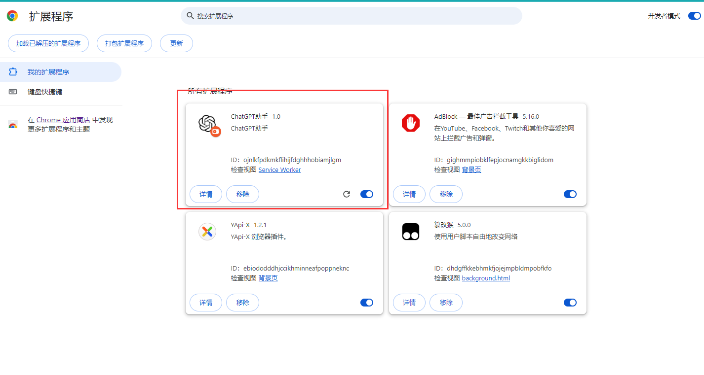
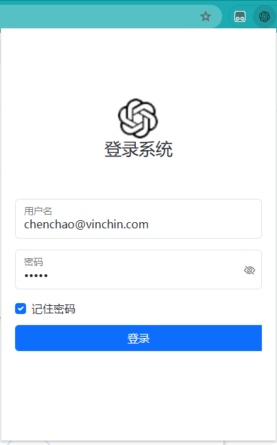
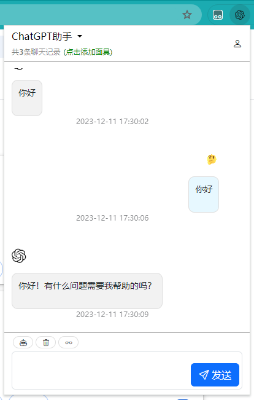
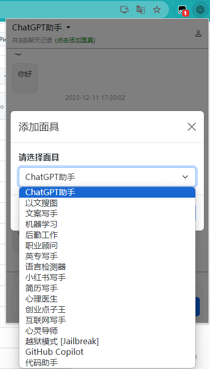
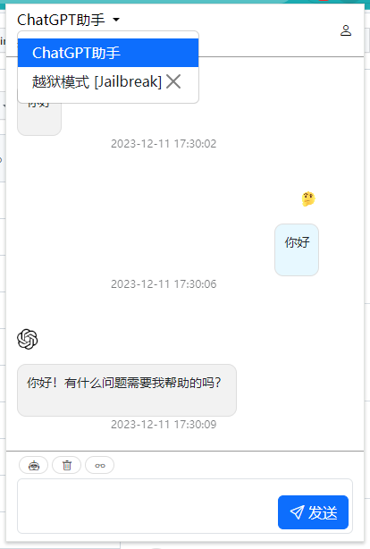

chrome extension ChatGPT

A ChatGPT plugin based on Chrome v3 extension

## preview

### extension page

### login page

### main page

### add mask

### change mask

## mention

> You cant use this software directly, you need to implement the following functions to function properly:
> 
> 1. Implement the interface defined by Config.js (except the official openai interface)
> 
> 2. If you don't have direct access to openai, then you may need a proxy
> 
> 3. You need to provide an openai ChatGPT development key
> 
> **Of course, everything is a small problem, you can do secondary development!**
>

## Star History

